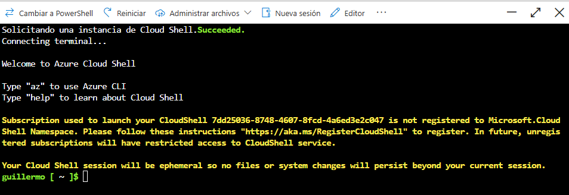

# Laboratorio 0
Este laboratorio es muy basico, simplemente existe para documentar todos los pasos que sigo. 

## Objetivo
El objetivo de este laboratorio es crear la cuenta de Microsoft Azure desde creo. Para completar crear la cuenta vamos a buscar configurar: 
1. Suscripcion funcional gratuita
2. Un Resource Group de prueba
3. Presupuesto/alertas de costes configuradas
4. Elegir una Region
5. Configurar Portal de Azure
6. Conocimiento de donde consultar consumo y costes
7. Primer contacto con Azure Cloud Shell

*No se va a crear ninguna maquina virtual.

## Procedimiento
### 1.- Creamos la cuanta de Azure
El tipo de cuenta de Azure que voy a crear es la cuentas gratuita de Azure, es justo lo que necesito para ir practicando como funciona Azure. 

### 2.- Comprobar la suscripcion
Inicio -> Buscador -> Buscar: suscripcion 
Dentro de la suscripcion observo en informacion general que la suscripcion en gratuita: 
1. Nombre de suscripcion: Azure subscription 1 
2. Estado: Activo 
3. Velocidad y prevision de gastos -> Costo actual: 0,00 

### 3.- Cambiar nombre a la suscripcion
Informacion general -> Cambiar nombre -> azure_labs 

### 4.- Configurar una alerta de presupuesto
Vamos a crear una alerta de coste para prevenir gastos: Administracion de costos -> Presupuestos -> Agregar  

La alerta se llama: Coste_0 
Importe de presupuesto: 1 
Condiciones de alerta -> Tipo: Coste real 
Condiciones de alerta -> Porcentaje del presupuesto: 50 

*La alerta solo avisa, no evita superar el gasto del presupuesto 

### 5.- Elegir region
Cuando creemos recursos hay que escoger una region, en mi caso escogere **Spain Central** 

### 6.- Abrir Cloud Shell
En la barra superior de la interfaz de Portal buscamos el simbolo de una terminal 
 

Voy a escoger Bash para aprender a manejarme inicialmente en Azure CLI. Despues, en la seleccion de "Cuenta de almacenamiento": No se requiere ninguna cuenta de almacenamiento. 
Escojo esta opcion porque de mometno solo quiero probar comandos, no es necesario que que guarde nada entre sesiones. 
 
