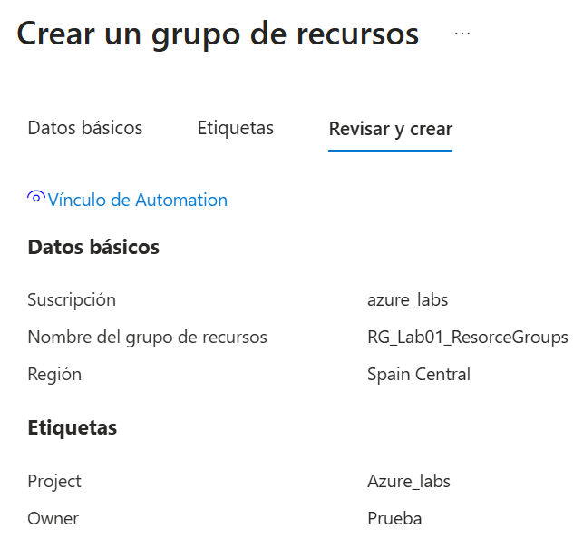
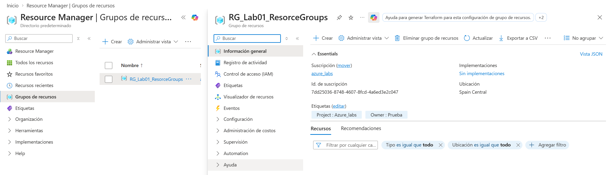
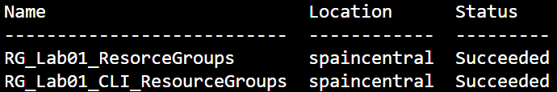

# Laboratorio 01
En este laloratorio quiero crear un Resource Group, tras terminar con las pruebas lo eliminare. Ya creare los que sean necesarios para siguientes laboratorios.

## Ojetivos
1. Crear un Resource Group usando Azure Portal
2. Crear un Resource Group usando Azure CLI
3. Consultar informacion sobre el Resource Group
4. Eliminar un Resource Group

## Procedimiento

### 1.- Crear un Reource Group con Azure Portal
Lo primero es buscar en el buscardor de la parte superior: `Resource Group`. Seleccionamos crear.<br>
<br>
Para crearlo necesitamos especificar la suscripcion a la que va asociada (en mi caso la gratuita), el nombre del grupo (RG_Lab01_ResourceGroups) y la region del grupo (Spain Central).<br>
<br>
Tras especificar los datos basicos vamos a la seccion de `Etiquetas`, para asociar datos co los recursos. Asi puedo filtrar y organizar los recursos. Voy a crear dos estiquetas: `Porject = Azure_labs` y `Owner = Prueba`.<br>
<br>
Revisamos la informacion del grupo y le damos a crear.<br>
<br>
<br>

Para comprobar que he creado correctamente el grupo de recursos voy a: `Resource Groups`<br>
<br>
En la imagen puedo ver las etiquetas que he agregado `Poject : Azure_labs` y `Owner : Prueba`. <br>
<br>

### 2.- Crear un Resource Group con Azure CLI
Para hacer esto, en Cloud Shell, lo primero que hago es comprobar que estoy trabajando con la suscripcion:
```bash
az account show -o table
```
En el resultado puedo observar que que en `Name` aparece el nombre de la suscripcion: `azure_labs`.<br>
**Nota:**
| Parte del codigo | Signifcado |
|------------------|------------|
| `az` | Ejecuta **Azure CLI** |
| `account` | Trabaja con la suscripcion |
| `-o` | Abreviatura de `--output` |
| `table` | Muestra el resultado como table |

<br>
<br>

Ahora voy crear otro Resource Group:
```bash
az group create \
    --name RG_Labs01_CLI_ResourceGroups \
    --location spaincentral \
    --tags Project=Azure_Labs Owner=Prueba
```
**Nota:**
| Codigo | Funcion |
|--------|---------|
| `az group create` | Crear un Resource Group |
| `--name RG_Labs01_CLI_Prueba` | Especifica el nombre |
| `--location spaincentral` | Indica la Region |
| `--tags` | Indica las etiquetas |

<br>
<br>

Compruebo que el grupo se ha creado correctamente consultando los Resource Groups
```bash
az group list -o table
```

<br>
<br>
Tambien quiero comprobar las etiquetas del grupo:
```bash
az group show \
    --name RG_Lab01_CLI_ResourceGroups \
    --query tags
```

**Nota**
| Codigo | Funcion |
|--------|---------|
| `az group show` | Mostrar ResourceGroups |
| `--query tags` | Seleccionar la informacion consultada |

## Limpieza
Voy a eliminar todos los Resource Groups que he creado, lo hare desde Azure CLI. Esto lo hago porque para los siguentes laboratorios ya creare sus correspondientes Resource Groups, de esta forma queda todo mas ordenado y limpio.<br>

Para borrar los Resource Groups usare el comando para cada uno:
```bash
az group delete \
    --name RG_Labs_CLI_ResourceGrops \
    --yes
```
## Aprendizaje
En este laboratorio sencillo he aprendido a manejarme para la gestion de Resource Groups, tanto en Azure Portal como en Azure CLI. Donde los conocimientos que he practicado son crear, borrar y mostrar los Resource Groups y su caracteristicas.

## Extra - Investigacion
Durante el laboratorio tenia solo dos Resource Groups creados. A la hora de querer eliminarlos he intentado hacerlo con un solo comando, pero en Azure CLI no te permite hacerlo con un solo comando. Ante este problema he buscado una solucion, porque si son muchos grupos puede resultar tedioso hacer el comando uno por uno.<br>
La solucion que he encontrado es usar un bucle `for` para eliminar los grupos:
```bash
for rg in RG_Lab01_CLI_ResourceGroups RG_Lab01_ResorceGroups; do
    az group delete --name "$rg" --yes
done
```
De esta forma, el bucle cada vez que da una vuelta y usa un nombre en la variable, ejecuta el comando para ese Resource Group.