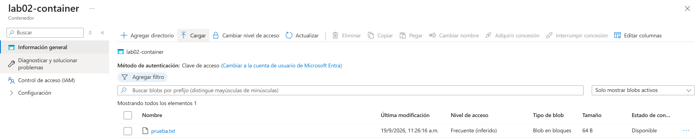
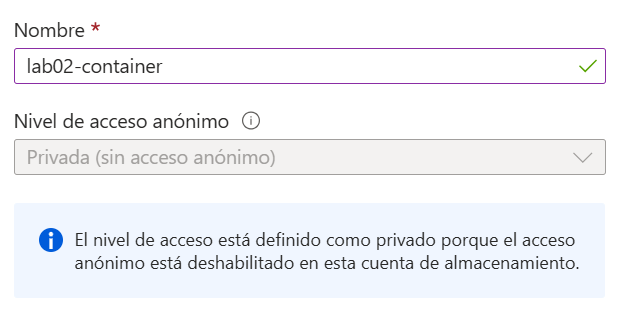
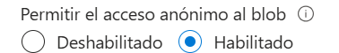
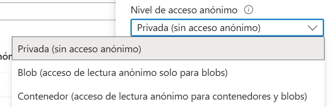
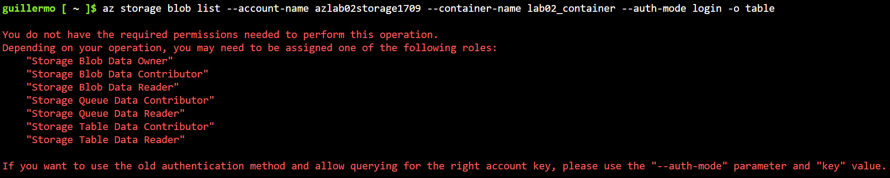
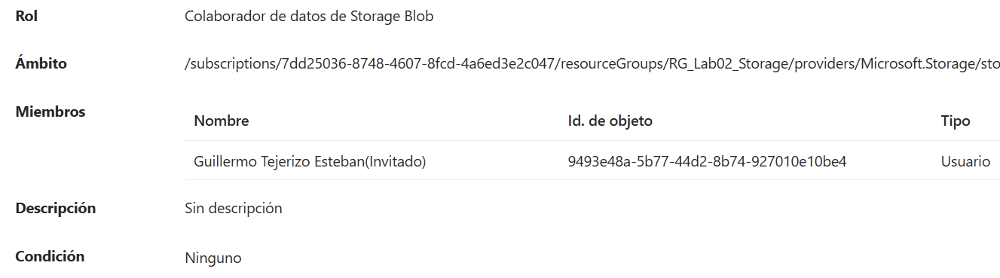
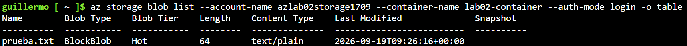

# Laboratorio 02
En este laboratorio voy a crear una `Storage Account`

## Objetivos
1. Crear una Storage Account
2. Crear un Blob Container
3. Subir y descargar archivos
4. Configurar el nivel de acceso de los blobs
5. Consultar los recursos desde Azure CLI

## Conceptos
Antes de empezar con el laboratorio quiero usar este apartado para mencionar conceptos que voy a usar. Asi en caso de que necesite refrescar cualquier cosa puedo venir a esta seccion:
1. Azure Storage = conjunto de servicios de almacenamiento (Blob Storage, Azure Files, Queue Storage, Table Storage)
2. Blob Storage = almacena no estructurados (Archivos y datos no estructurados)
3. Blob = archivo almacenado

## Procedimiento
### 1.- Crear Resource Group
Lo primero de todo, voy a crear el Resource Group que voy a usaren este laboratorio. Tendra de nombre `RG_Lab02_Storage`y estara en la region `Spain Central`, contara con las etiquetas `Project : Azure_labs` y `Lab : 02-Storage`<br>
<br>

### 2.- Crear Storage Account
Busco en el buscador `Storage Account`. Despues aparece para crear la cuanta de almacenamiento, donde selecciono la suscripcion que voy a utilizar, `azure_labs`, y el grupo de recursos, `RG_Lab02_Storage`. Una vez he seleccionado la suscripcion y el grupo de recursos le voy a poner un nombre: `azlab02storage1709` y la region `Spain Central`.<br>

En la parte de `Servicio principal` he seleccionado `Azure Blob Storage`, ya que es el tipo de documentos que voy a alamacenar. El rendimiento es `Estandar`, el `Premium` es para cargas de trabajo con un alto rendimiento de almacenamiento y yo estoy haciendo un laboratorio muy basico. Y para la redundancia he seleccionado `Locally-redundant storage (LRS)` para que haga las copias en una unica region.<br>

En el apartado de `Avanzado` voy a dejar los valores predeterminados. Tras eso le doy a `Revisar y crear` y creo la cuenta de almacenamiento:<br>
<br>

### 3.- Crear Blob Container
Para crear el Blob Container, accedo a la `storage Account` y me voy al apartado `Contaiiners`. Creo un nuevo contenedor, se llama `lab02-container`. Quiero que el contenedor no sea accesibles de forma publica, asi que selecciono la opcion `Private (no anonymous access)` ***MIRAR LA SECCION DE PROBLEMAS**. Con esta configuracion creo el contenedor.<br>

Ahora voy a probar a subir un archivo al contenedor. Para ello entramos en el contenedor y selecciono `Upload` y selecciono el archivo.<br>
<br>

Ahora que tenemos un archivo podemos hacer distintas acciones. Podemos descargarlo, copiar la URL, clonarlo o ver las propiedades.<br>

### 4.- Comprobaciones por Azure CLI
A parte de manejar la interfaz grafica quiero aprender a manejarme por **Azure CLI**, para ello voy a empezar haciendo comprobaciones mostrando los **Resource Groups**, las **Storage Account**, y realizando consultas.<br>

Lo primero va a ser mostrar nuestro **Resource Group**:<br>
```bash
az group show \
    --name RG-Lab02-Storage \
    -o table
```
<br>

Ahora quiero listar las **Storage Accounts**:<br>
```bash
az storage account list -o table
```

**Nota:**
| Codigo | Funcion |
|--------|---------|
| `storage` | Indica que se trabaja con **Azure Storage** |
| `account` | Indica el recurso, en este caso la **Storage Account** |
| `list` | Sirve para listar el contenido. |

<br>


Tras ver que **Storage Accounts** hay, realizo una consulta:<br>
```bash
az storage account show \
    --name azlab02storage1709 \
    --resource-group RG-Lab02-Storage \
    -o table
```
<br>

Lo siguiente es consultar los **Containers**:<br>
```bash
az storage container list \
    --accuont-name azlab02storage1709 \
    --auth-mode login \
    -o table
```

**Nota:**
| Codigo | Funcion |
|--------|---------|
| `--auth-mode` | Indica el modo de autenticarse |
| `login` | Indica la sesion actual |

<br>

Y por ultimo, listar los **Blobs**:<br>
```bash
az storage blob list \
    --account-name azlab02storage1709 \
    --container-name lab02-container \
    --auth-mode login \
    -o table
```

**Nota:**
| Codigo | Funcion |
|--------|---------|
| `storage blob` | Indica que voy a trabajar con **Blob Storage** |
| `--account-name` | Indica el nombre de la **Storage Account** |
| `--cintainer-name`| Nombre del contenedor |

***MIRAR LA SECCION DE PROBLEMAS**

## Limpieza
Voy a borrar todos los recursos creados en este laboratorio, ya que en los siguientes laboratorios se crearan los recursos que necesiten.

## Aprendizaje
En este laboratorio he comprendido mejor a diferenciar **Storage Account**, **Container** y **Blob**. Además de entender la jerarquia `suscripcion > Resource Group > Storage Account > Container > Blob`.

## Problemas
### 1.- Seleccion del Nivel de acceso
Cuando he querido crear un contenedor, a la hora de selccionar el nivel de acceso, salia de forma predeterminada la opcion `Private (no anonymous access)`. Aunque es la opcion que queria seleccionar, quiero tener la posibilidad de seleccionar otras opciones.<br>
<br>

Lo primero que veo es el mensaje de:
```
<<El nivel de acceso está definido como privado porque el acceso anónimo está deshabilitado en esta cuenta de almacenamiento.>>
```
<br>

Lo primero es diferenciar los tipos de acceso:
1. Private - Indicaque es necesario autenticarse para acceder al Blob
2. Public/Anonymous - Permite accedeer sin acceso a cualquier persona que tenga la URL

Tras entender esa diferencia, he buscado porque me ha pasado esto, el motivo es simple ya que la configuracion de `azlab02storage1709` que hice predeterminada. Cuando se crea una **Storage Account**, hay una opcion de seguridad, `Allow Blob anonymous access`, y por defecto esta deshabilitada. Esta opcion cuando no esta habilitada no permite configurar ningun contenedor para acceso publico.<br>

Con esto en mente, la solucion del problema es sencilla, simplemente hay que habilitar esta opcion. Lo primero es ir a la **Storage Account** y entrar en la configuracion. Y buscamos la opcion `Allow Blob anonymous access` y la habilitamos, luego guardamos los cambios.<br>
<br>

Ahora que ya esta habilitado, comprobamos que me deja seleccionar el nivel de acceso al crear un contenedor:<br>
<br>

### 2.- Permisos requeridos
En el momento de hacer la consulta para listar los **Blob**, me ha aparecido un error indicando la falta de permisos:<br>
<br>

El error de los permisos viene de que mi cuenta no tiene un **rol de datos de Storage** asignado. Para asignar un rol tengo que ir a `azlab02storage1709 > Access Control (IAM) > Add role assigment`. Busco el rol `Storage Blob Data Contributor` y se lo asigno a mi usuario:<br>
<br>

Una vez que he agregado el rol compruebo que funciona:<br>
<br>

El rol de `Storage Blob Data` para trabajar con los datos **Blob** y escogemos el rano `Contributor` porque no es necesario mas permisos.