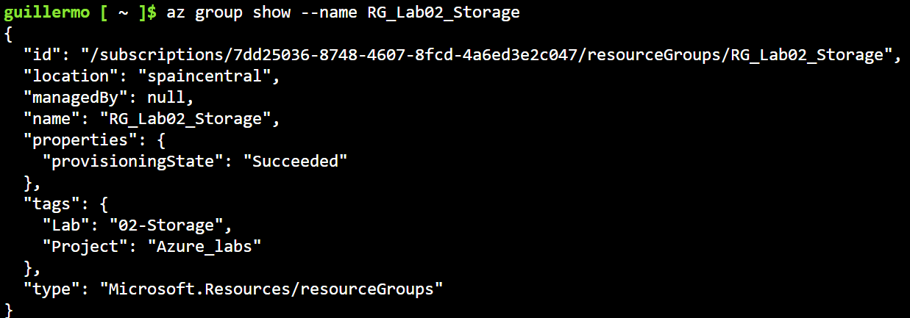

# Laboratorio 02
En este laboratorio voy a crear una `Storage Account`

## Objetivos
1. Crear una Storage Account
2. Crear un Blob Container
3. Subir y descargar archivos
4. Configurar el nivel de acceso de los blobs
5. Consultar los recursos desde Azure CLI

## Conceptos
Antes de empezar con el laboratorio quiero usar este apartado para mencionar conceptos que voy a usar. Asi en caso de que necesite refrescar cualquier cosa puedo venir a esta seccion:
1. Azure Storage = conjunto de servicios de almacenamiento (Blob Storage, Azure Files, Queue Storage, Table Storage)
2. Blob Storage = almacena no estructurados (Archivos y datos no estructurados)
3. Blob = archivo almacenado

## Procedimiento
### 1.- Crear Resource Group
Lo primero de todo, voy a crear el Resource Group que voy a usaren este laboratorio. Tendra de nombre `RG_Lab02_Storage`y estara en la region `Spain Central`, contara con las etiquetas `Project : Azure_labs` y `Lab : 02-Storage`
 
