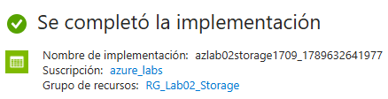

# Laboratorio 02
En este laboratorio voy a crear una `Storage Account`

## Objetivos
1. Crear una Storage Account
2. Crear un Blob Container
3. Subir y descargar archivos
4. Configurar el nivel de acceso de los blobs
5. Consultar los recursos desde Azure CLI

## Conceptos
Antes de empezar con el laboratorio quiero usar este apartado para mencionar conceptos que voy a usar. Asi en caso de que necesite refrescar cualquier cosa puedo venir a esta seccion:
1. Azure Storage = conjunto de servicios de almacenamiento (Blob Storage, Azure Files, Queue Storage, Table Storage)
2. Blob Storage = almacena no estructurados (Archivos y datos no estructurados)
3. Blob = archivo almacenado

## Procedimiento
### 1.- Crear Resource Group
Lo primero de todo, voy a crear el Resource Group que voy a usaren este laboratorio. Tendra de nombre `RG_Lab02_Storage`y estara en la region `Spain Central`, contara con las etiquetas `Project : Azure_labs` y `Lab : 02-Storage`
 

### 2.- Crear Storage Account
Busco en el buscador `Storage Account`. Despues aparece para crear la cuanta de almacenamiento, donde selecciono la suscripcion que voy a utilizar, `azure_labs`, y el grupo de recursos, `RG_Lab02_Storage`. Una vez he seleccionado la suscripcion y el grupo de recursos le voy a poner un nombre: `azlab02stotage1709` y la region `Spain Central`. 

En la parte de `Servicio principal` he seleccionado `Azure Blob Storage`, ya que es el tipo de documentos que voy a alamacenar. El rendimiento es `Estandar`, el `Premium` es para cargas de trabajo con un alto rendimiento de almacenamiento y yo estoy haciendo un laboratorio muy basico. Y para la redundancia he seleccionado `Locally-redundant storage (LRS)` para que haga las copias en una unica region. 

En el apartado de `Avanzado` voy a dejar los valores predeterminados. Tras eso le doy a `Revisar y crear` y creo la cuenta de almacenamiento:
 

### 3.- Crear Blob Container
Para crear el Blob Container, accedo a 