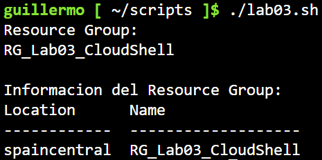

# Laboratorio 03
En este laboratorio voy a aprender a utilizar **Clous Shell**.

## Objetivos
1. Utilizar Azure CLI desde Cloud Shell
2. Realizar consultas a la suscriocion.
3. Trabajar con **Resource Groups** medinate CLI
4. Crear, consultar y eliminar recursos
5. Utilizar variables
6. Guardar archivos en Cloud Shell

## Conceptos
Antes de empezar con el laboratorio em gustaria mencionar y explicar los conceptos que voy a usar. De esta forma, en caso de que necesite refrescar alguno de estos conceptos, simplemente tengo que venir a esta seccion.<br>
1. **Azure Cloud Shell** = Entorno de linea de comandos que podemos usar desde el navegador.
2. **Azure CLI** = Herramienta de comandos para administrar Azure.

## Procedimiento
### 1.- Preparacion
Lo primero de todo es preparar el entorno de trabajo, que tendrá un **Resouce Group**, `RG_Lab03_CloudShell` con la ragion `spaincentral` y las etiquetas: `Project : Azure_labs`  y`Lab : 03-CloudShell`.<br>

Para las comprobaciones quiero crear una **Storage Account**, `azlab03cloudshell1909`, con un contenedor llamado `lab03-container-portal` y que tenga dentro un documento de prueba. La cuenta de almacenamiento tendra un nivel de acceso privado.<br>

Todo esto lo realizare a traves de **Azure CLI**.<br>

### 2.- Comprobaciones
Lo primero que voy a hacer es acceder a **Cloud Shell**, para realizar comprobaciones sobre la informacion de la cuenta de Azure y sus recursos:<br>

Comprobar que **Azure CLI** esta dsiponible
```bash
az version
```

Ver informacion de la **suscripcion actual**
```bash
az account show -o table
```

Mostrar las **suscripciones disponibles** para mi cuenta
```bash
az sccount list -o table
```

Comprobar que la suscripcion esta activa
```bash
az account show \
    --query "{Name:name, Suscription:id, Tenant:tenantId}" \
    -o table
```
**Nota:**<br>
`--query` sirve para filtrar, seleccionar y modificar los datos que devuelven los comandos en la terminal. **Azure CLI** devuelve sus datos en formaton JSON. En este formato sería: `Nombre:name`. `Nombre` es el nombre que le das a la etiqueta del dato, y `name` indica el parametro de donde saca la informacion.
<br>

### 3.- Crear un Resource Group
Tras realizar las consultas y ver que la informacion es correcta, voy a crear el **Resource Group**. Para ello hare:<br>

```bash
az group create \
    --name RG_Lab03_ClousShell \
    --location spaincentral \
    --tags Project=Azure_labs Lab=03-CloudShell
```
<br>

### 4.- Variables en Bash
Se puede guradar informacion en variables, `RG="RG_Lab03_CloudShell"`, y conprobarla:
```bash
az group show \
    --name "$RG" \
    -o table
```
<br>

Ahora, quiero crear un **Rsource Group** usando la avriable: `TEST_RG="GR_LAB03_Test"`:<br>
```Bash
az group create \
    --name "$TEST_RG" \
    --location spaincentral
```
<br>

Compruebo que se ha creado:<br>
```bash
az group show \
    --nmae "$TEST_RG" \
    -o table
```
<br>

Y lo eliminamos:<br>
```bash
az group delete \
    --name "$TEST_RG" \
    --yes
```
<br>

### 5.- Consultas desde Cloud Shell
Consulto los recursos para comrobar que se han creado correctamente:<br>
```bash
az resource list -o table
```
<br>

El resultado esta vacio porque no tengo ningun recurso dentro del **Resource Group**.<br>

### 6.- Comandos de Bash en Cloud Shell
Cloud Shell proporciona un entorno linux, por lo que voy a usar distintos comandos. Lo primero es crear un archivo:<br>
```bash
echo "Azure Cloud Shell - Lab 03" > lab03.txt
```
<br>

Comprobamos que se ha creado:<br>
```bash
ls
```
<br>

Y comprobamos su contenido:<br>
```bash
cat lab03.txt
```
<br>

Tras comprobar que se ha creado correctamente el documento, vamos a comprobar el directorio actual:<br>
```bash
pwd
```
<br>

La consulta devuelve '/home/guillermo`.<br>

### 7.- Crear un script
Quiero hacer un script sencillo para probar el funcionamiento. Lo primero es crear un directorio para guardar el script:<br>
```bash
mkdir scripts
```
<br>

Despues creo el archivo del script:<br>
```bash
nano lab03.sh
```
<br>

Y escribo el codigo:<br>
```bash
#!/bin/bash

RG="RG_Lab03_CloudShell"

echo "Resource Group:"
echo "$RG"
echo ""
echo "Informacion del Resource Group:"
az group show --name "$RG" -o table
```
<br>

Le doy permisos:<br>
```bash
chmod +x lab03.sh
```
<br>

Y lo ejecuto:<br>
<br>

## Limpieza
Como en todos los laboratorios, borramos el **Resource Group**. En los siguientes laboratorios crearemos todos los recursos que necesiten.