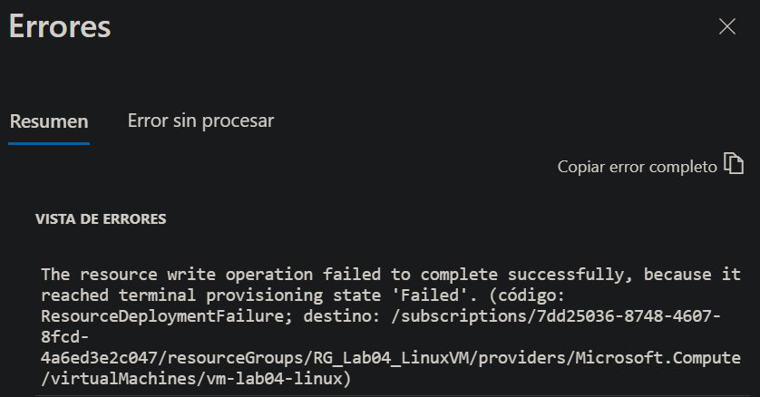
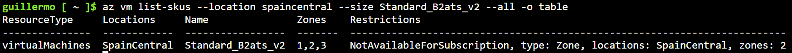

# Laboratorio 04
En este laboratorio quiero empezar a trabajar con infraestructura dentro de Azure creando alguna maquina virtual.

## Objetivos
1. Creacion de un Virtual Machine
2. Configuracion de una red virtual
3. Acceso mediante SSh
4. Administracion de VM mediante Azure CLI
5. Instalacion de un servicio web

## Conceptos
Como en los labpratorios anteriores, quiero poner en esta secion los terminos que vamos a utilizar durante el laboratorio, para en caso de ser necesario consulta la informacion.<br>
1. **Virtua Machine** = Dispositivo virtualizado
2. **Image (Imagen)** = Indica u sistema operativo
3. **VM Sieze** = Recursos asignados

## Arquitectura
```
                Azure
                  |
              Suscripcion
                  |
            RG_Lab04_LinuxVM
                  |
    ┌─────────────┴────────────────┐
    |                              |
    VM                      Virtual Network
    |                              |
Ubuntu Linux                     Subnet
    |                              |
Apache/Nginx             Network Security Group
                                   |
                          SSH :22  |
                         HTTP :80  | 
                                   |
                                Public IP
                                   |
                                Internet

```
<br>

**IMPORTANTE:** Como este laboratorio puede crear costes, para evitarlo voy a crear maquinas virtuales de pequenio tamanio, no agregar discos innecesarios, no usar servicios como Bastion y eliminar todo lo creado al terminar.<br>

## Configuracion
Para el entorno de este laboratorio crearemos el Resource Group `RG_Lab04_LinuxVM` con region en `spaincentral` y las etiquetas: `Project : Azure_labs` y `Lab : 04-LinuxVM`.

## Procedimiento
### 1.- Crear una VM
Para crear la maquina virtual, hay que entrar en **Virtual Machines -> Create -> Azure Virtual machine**. Para la creacion selecciono la suscripcion (azure_labs), el grupo de recursos (RG_Lab04_LinuxVM) y la region (Spain Central). Para esta maquina virtual voy a dejar las configuraciones predeterminadas y el nombre de la maquina es: **vm-lab04-linux**.<br>

Ahora voy a pasar a la configuracion de las caracteristicas de la maquina virtual. Lo primero de todo es seleccionar la **Image** del SO, que sera **Ubuntu Server 24.04 LTS**. Despues selecciono el tamanio en **Size** (CPU, RAM, Red y rendimiento), en esta parte hay que tener especial cuidado porque es donde pueden aumentar los costes, en mi caso he buscado ``Standard_B2ats_v2`` (2vcpus y 1 GiB memory) ya que si entra incluida en la suscripcion gratuita. Para la arquitectura selecciono ``x64``. <br>

Tras lo anterior, voy a configurar el usuario para conectarse a Linux. Lo primero es seleccioar ``SSH public key`` sin contrasenia. Despues, idicare el nombre del usuario, **azreuser**, y en ``SSH public key source`` selecciono ``Generate new key pair`` ya que es la primera vez que utilizo SSH en Azure.<br>

```
NOTA: cuando selecciono esta opcion lo que sucede es que Azure genera una clave publica que se descarga en la maquina virtual, y la clave privada se descarga en mi equipo. Por motivos obvios de seguridad, este archivo no se subira en GitHub.
```
<br>

Lo siguiente a configurar son los puertos que estan habilitados. Para ello desahibilito todos menos el puerto 22 para acceder por **SSH**.<br>

Tras la cinfiguracion de los puertos, toca configurar el disco **(Disk)**. En esta seccion seleciono ``Standard SSD`` en el tipo de disco, dejo los 30 GB de tamanio, y el resto de la configuracion predeterminada.<br>

El siguiente paso de la configuracion es la red, donde unicamente pondre el nombre a la red, **vnet-lab04**. Las demas configuraciones las dejo predetreminadas, ya que la IP publica esta habilitada, en Network Security Group (NSG) solo esta habilitado el trafico por el puerto 22.<br>

Todas las demas opciones de configuracion las dejo predeterminadas. En futuros laboratorios ya entrare mas afondo con dichas configuraciones, como para **Azure Monitor**. Y tras esto creamos la maquina virtual, pero antes, al revisar comprobamos el precio para evitar gastos.<br>

```
NOTA: aunque en el precio ponga un gasto por hora, las primeras 750 horas al mes de las VM son gratuitas. Este se distribuye a todas las VM creadas en la suscripcion. Las horas gratuitas se renuevan cada mes
```
<br>

## Errores
### Implementacion de la VM
Al intentar crear e implementar la maquina virtual, hubo un error:<br>

<br>

Al buscar este error, encontre informacion donde especificaba que el espacio de la zona seleccionada estaba ocupado y no habia suficiente almacenamiento para mi VM.<br>

Lo primero que hago es comprobar mediante Azure CLI las zonas que admite el SKU (Stock Keeping Unit), el identificador de una variante de servicio o recurso, mediante el siguiente comando:<br>
```bash
az vm list-skus \
    --location spaincentral \
    --size Standard_B2ats_v2 \
    --all \
    --o table
```
<br>


<br>

